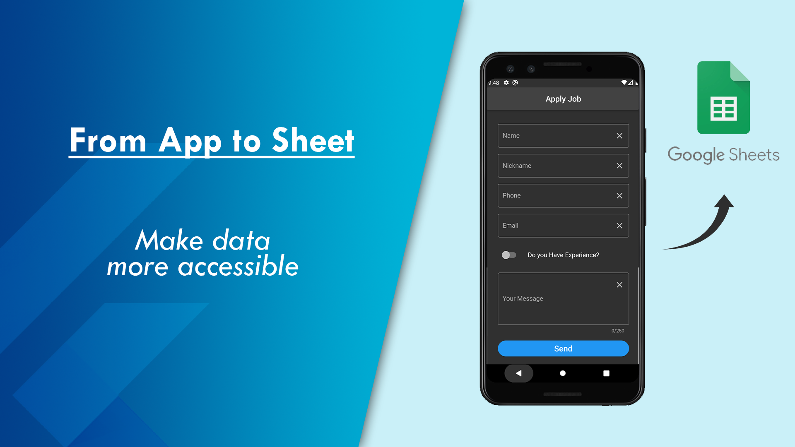
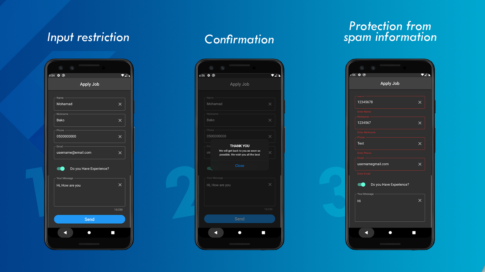
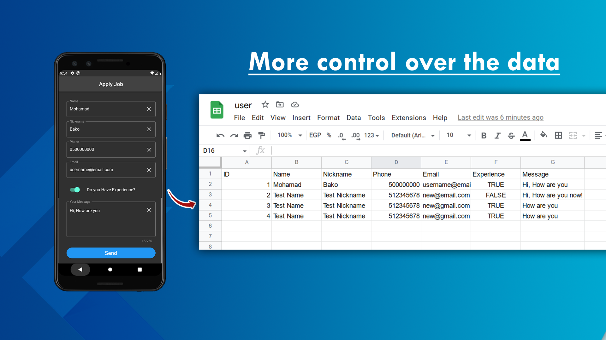

# Storing data from the Flutter app → Google Sheets
Sample app which stores data of user from the **Flutter app into Google Sheets using Google Sheets API**.
The goal is to ease access and control of data⚡️.
## Notes 💬

- I used [gsheets](https://pub.dev/packages/gsheets) library
- I used Google Sheets API form Google Cloud Console
- All inputs are controlled to avoid spam information

## Screenshots

## 🔗 Links
[Twitter ](https://twitter.com/MohamadBakko)
